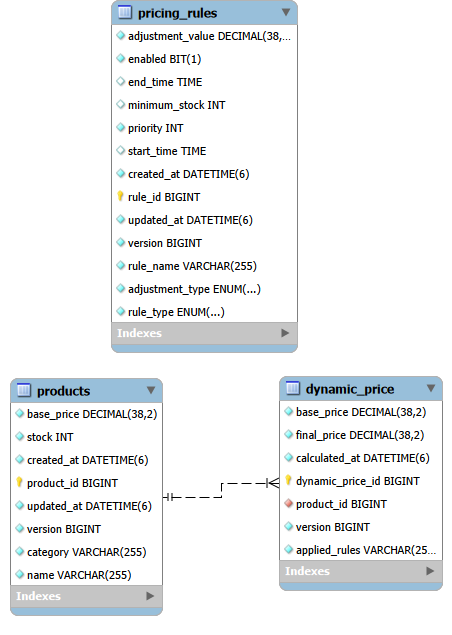

# Dynamic Pricing Engine

## Project Overview
The Dynamic Pricing Engine is a Spring Boot backend application that dynamically calculates product prices using configurable business rules. It supports discount, surge, time-based, and inventory-based pricing strategies. The system applies enabled pricing rules based on their priority and stores every calculated price for future reference.

## Features
1. Project Overview
2. Features
3. Technology Stack
4. Project Architecture
5. Database Schema
6. API Endpoints
7. Design Patterns
8. Validation
9. Exception Handling
10. Caching
11. Logging
12. How to Run
13. Swagger
14. Future Enhancements

## Technology Stack

- Java 21
- Spring Boot
- Spring Data JPA
- Hibernate
- MySQL
- Maven
- Lombok
- Spring Cache
- Swagger (OpenAPI)

## Project Architecture

```
Controller
     │
     ▼
Service Layer
     │
     ▼
Strategy Pattern
     │
     ▼
Repository Layer
     │
     ▼
MySQL Database
```

## Database Schema

The application contains the following tables:

- products
- pricing_rules
- dynamic_price

### ER Diagram



---

## API Endpoints

### Product APIs

| Method | Endpoint | Description |
|---------|----------|-------------|
| POST | `/api/products` | Add a new product |
| GET | `/api/products` | Get all products |
| GET | `/api/products/{productId}` | Get product by ID |
| PUT | `/api/products/{productId}` | Update product |
| DELETE | `/api/products/{productId}` | Delete product |

---

### Pricing Rule APIs

| Method | Endpoint | Description |
|---------|----------|-------------|
| POST | `/api/pricing-rules` | Add pricing rule |
| GET | `/api/pricing-rules` | Get all pricing rules |
| GET | `/api/pricing-rules/{ruleId}` | Get pricing rule by ID |
| PUT | `/api/pricing-rules/{ruleId}` | Update pricing rule |
| PATCH | `/api/pricing-rules/{ruleId}/enable` | Enable pricing rule |
| PATCH | `/api/pricing-rules/{ruleId}/disable` | Disable pricing rule |
| DELETE | `/api/pricing-rules/{ruleId}` | Delete pricing rule |

---

### Dynamic Pricing APIs

| Method | Endpoint | Description |
|---------|----------|-------------|
| POST | `/api/pricing-engine/calculate/{productId}` | Calculate dynamic price |

---

## Pricing Rules Supported

The pricing engine supports the following rule types:

- **DISCOUNT** – Reduces the product price.
- **SURGE** – Increases the product price.
- **TIME_BASED** – Applies pricing only within a configured time range.
- **INVENTORY** – Applies pricing based on available product stock.

---

## Design Patterns

### Strategy Pattern

The Strategy Pattern is used to apply different pricing algorithms dynamically.

Implemented strategies:

- PercentageStrategy
- FixedAmountStrategy
- TimeBasedStrategy
- InventoryStrategy

### Factory Pattern

`PricingStrategyFactory` selects the appropriate pricing strategy at runtime based on the rule type.

---

## Validation

The application performs the following validations:

- Duplicate product name validation
- Duplicate pricing rule validation
- Positive adjustment value validation
- Time-based rule validation (Start Time must be before End Time)
- Inventory rule validation (Minimum Stock cannot be negative)
- Request validation using Jakarta Bean Validation

---

## Exception Handling

Global exception handling is implemented using `@RestControllerAdvice`.

Custom exceptions include:

- ProductNotFoundException
- PricingRuleNotFoundException
- DuplicateProductException
- DuplicatePricingRuleException

All exceptions return a consistent JSON error response.

---

## Caching

Spring Cache is used to improve application performance.

Caching is implemented for:

- Get Pricing Rule by ID
- Update Pricing Rule
- Delete Pricing Rule

---

## Logging

SLF4J logging is implemented throughout the application.

Logging includes:

- Product operations
- Pricing Rule operations
- Dynamic price calculations
- Validation failures
- Exception details

---

## How to Run

### Clone the Repository

```bash
git clone <repository-url>
```

### Open the Project

Import the project into your preferred IDE (Eclipse or IntelliJ IDEA).

### Configure MySQL

Create a database named:

```sql
CREATE DATABASE dynamic_pricing_engine;
```

Update `application.properties` with your MySQL username and password.

### Run the Application

Run the Spring Boot application.

The application starts on:

```
http://localhost:8080
```

---

## Swagger Documentation

Swagger UI is available at:

```
http://localhost:8080/swagger-ui/index.html
```

---

## Sample Project Structure

```
src
├── controller
├── dto
├── entity
├── enums
├── exception
├── mapper
├── repository
├── service
│   ├── Inter
│   ├── impl
│   └── strategy
├── util
└── DynamicPricingEngineApplication
```

---

## Future Enhancements

- Redis Cache
- JWT Authentication & Authorization
- Role-Based Access Control
- Rule Scheduling
- Rule Expiry
- Kafka Integration
- Dashboard & Analytics
- Docker Support
- Kubernetes Deployment
- CI/CD Pipeline
- Unit Testing
- Integration Testing

---

## Author

**Shaik Mohammad Ali**

Backend Developer | Java | Spring Boot | MySQL

---

## License

This project was developed for learning purposes and as part of an Advanced Spring Boot assignment.


